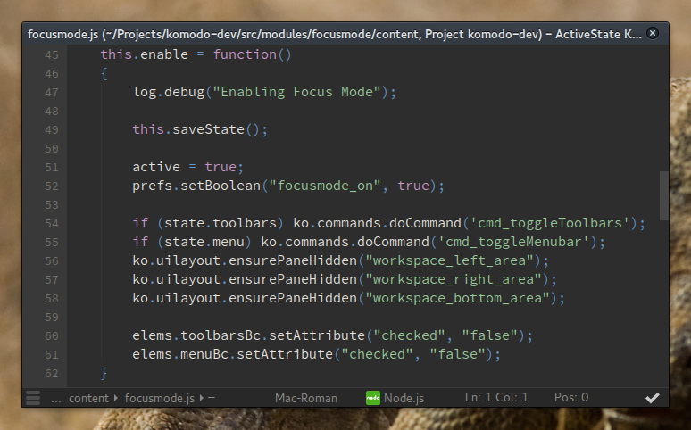

Plain and simple, this adds a new keybinding and menu entry (under the View menu)
which allows you to quickly toggle all panes, toolbars and menus.

This will be built-in to Komodo 9.2 by default.

Note when using on Komodo 9.1 that due to a bug in that version the toggle menu
entry may not show up in the "unified menu" (burger menu).

Building
========

To build the Focus Mode addon please refer to the documentation on building an extension:

http://community.activestate.com/forum/introduction-building-komodo-extension

Note that this addon needs to be built using the --unjarred flag, ie.

  koext build --unjarred
